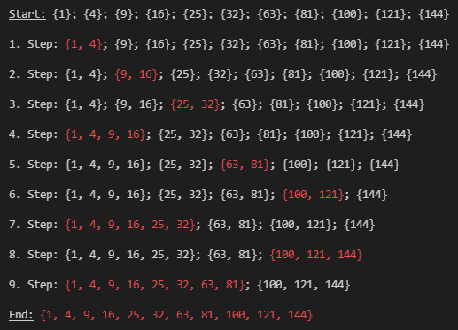
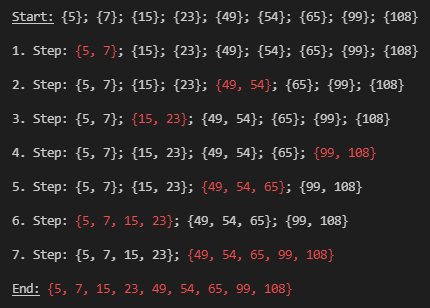

  

# Hierarchical Clustering
For a given list of points this little `python` program calculates the nessesary steps to cluster all points according to the maximum linkage until they are combined into a single cluster.

## Input
For testing purposes a list of points is given. To see the clustering for your own points, you can input them as follows: 
`python main.py ...` (e.g. `python main.py 7 5 15 99 108 54 23 65 49` resulting in the following output)

  

